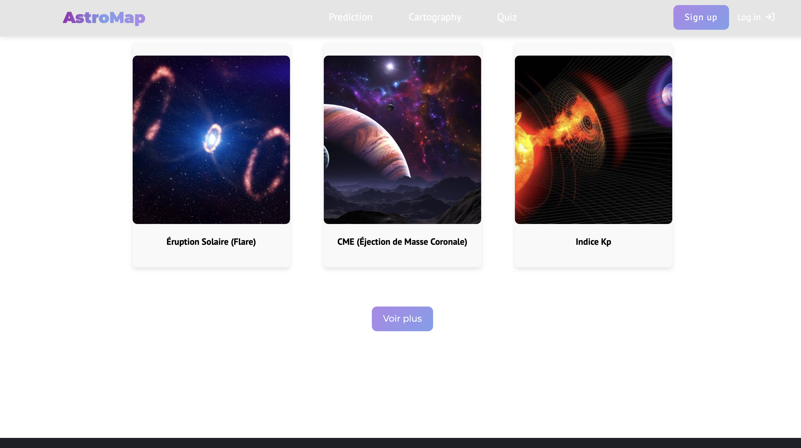
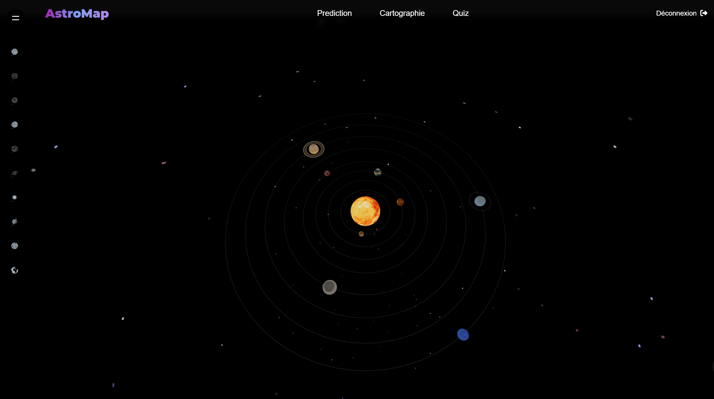
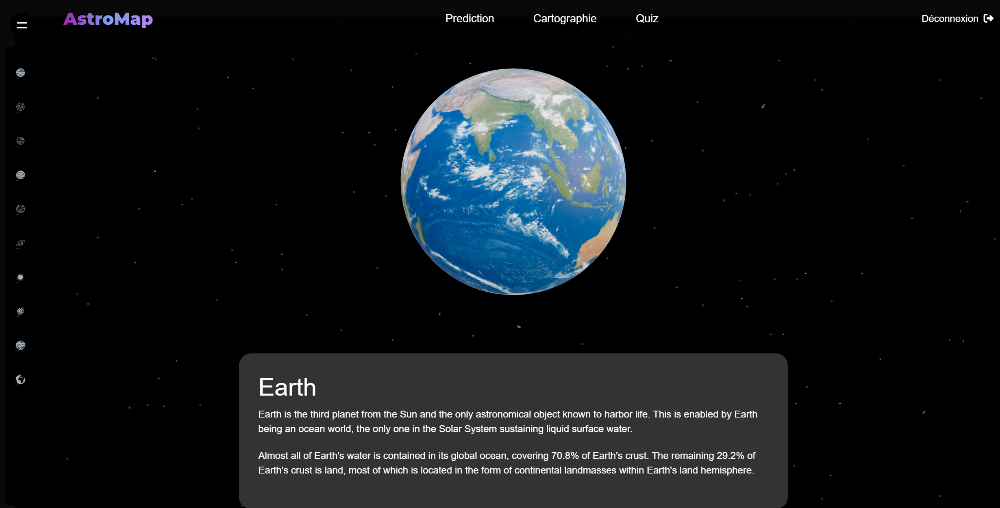
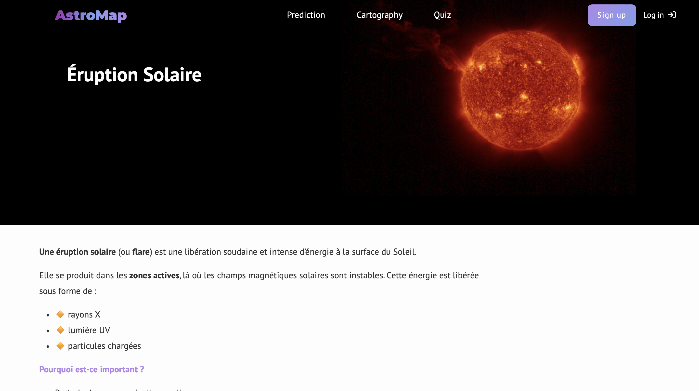
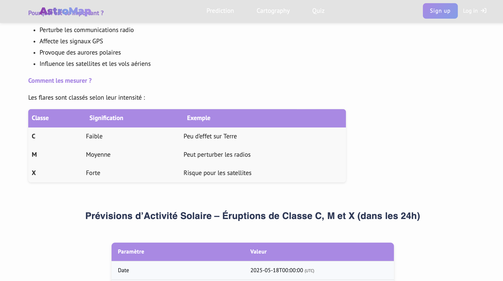
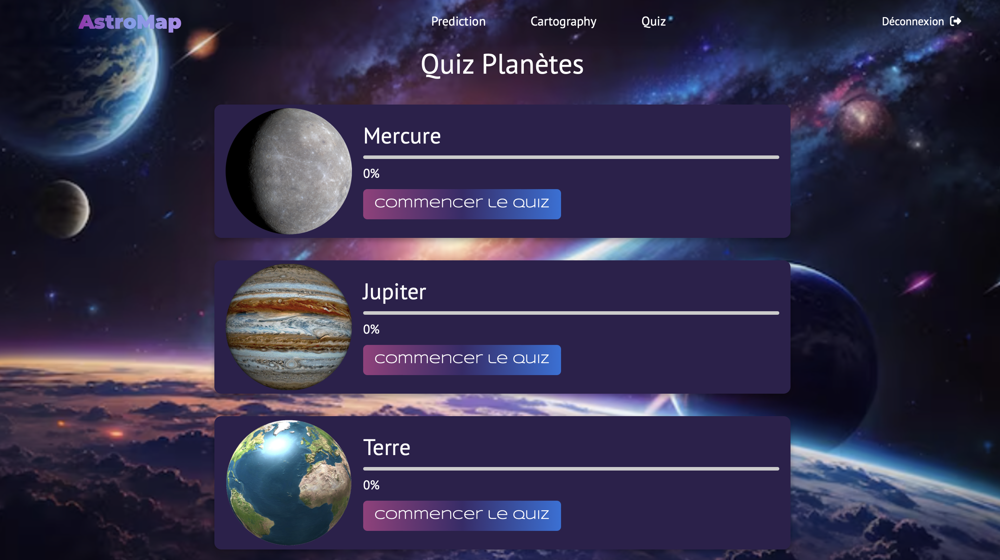

# AstroMap

AstroMap est une plateforme éducative et interactive dédiée à l'exploration spatiale. Elle permet aux utilisateurs de :  

- **Naviguer en 3D** dans le système solaire grâce à **React Three Fiber**  
- **Accéder à des informations détaillées** sur les planètes  
- **Participer à des quiz thématiques** pour tester leurs connaissances en astronomie  
- **Consulter des prédictions** sur les prochains phénomènes astronomiques  

### ⚙️ Technologies utilisées  

- **Backend** : Spring Boot (gestion des données et API)  
- **Données des objets célestes** : Intégration d'API externes (NOAA – Space Weather Prediction Center (SWPC))  
- **Frontend** : React.js avec Three.js pour des visualisations 3D immersives  

---

## 🖼️ Aperçu des interfaces

### Page d'accueil


### Suite de la page d'accueil (prédiction en temps réel de ces événements)


### Page d'inscription


### Page de connexion


### Cartographie 


### Exemple d'interface d'information sur une planète


### Détail d'une prédiction astronomique


 


### Interface du quiz


### Résultat du quiz


---


 

##   Bien démarrer

Suivez ces étapes pour exécuter le projet en local :

### Cloner le dépôt

```bash
git clone https://github.com/m-elhamlaoui/development-platform-k-a-s-a.git
```


## Accéder au dossier du projet
```bash
cd development-platform-k-a-s-a
```


## Lancer le projet avec Docker
Assurez-vous que Docker et Docker Compose sont installés sur votre machine, puis exécutez la commande suivante :

```bash
docker-compose up --build
```


